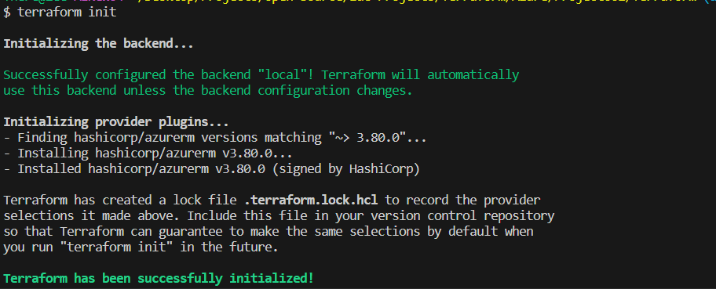
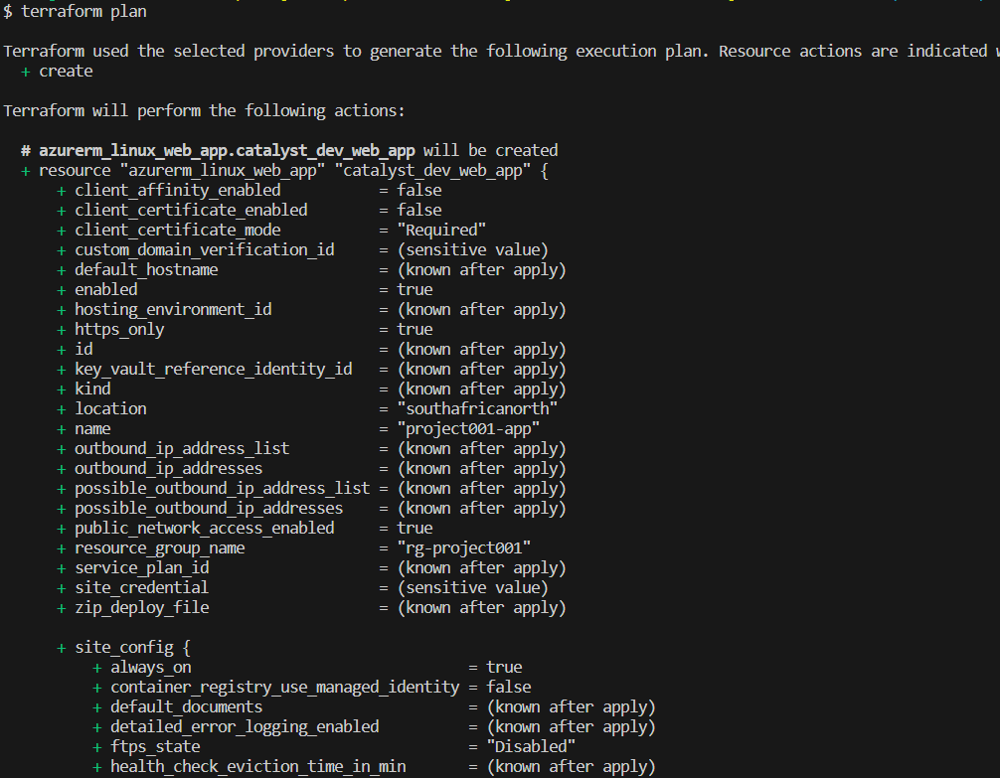
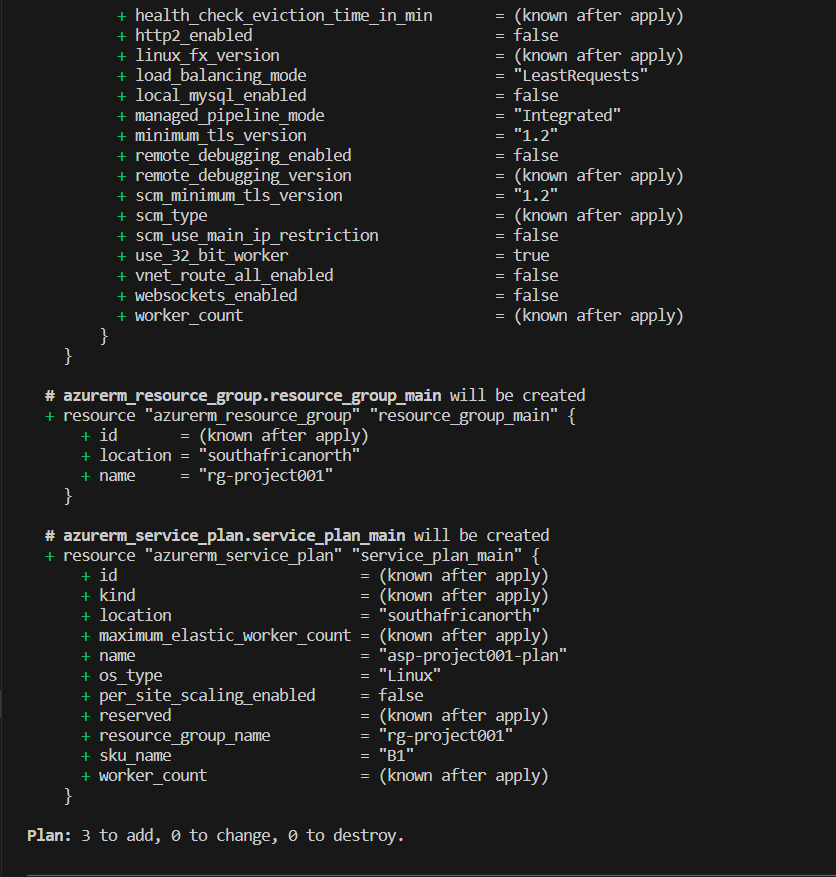
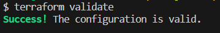

This is a simple infrastructure architecture involving the use of terraform to provision an app service, the app service in this case is a webapp.
In other to successfully create this infrastructure the following prequisite is required.
- Install Terraform
- Create an Azure Account
- login to your Azure Account on your terminal, This project is basic hence would be ran from the terminal.

Azure Cloud

|

+-- Azure Portal

|

+-- Terraform Script

|

+-- Azure Resource Group (RG)

    |
    +-- Terraform Apply
        |
        +-- Azure Services
            |

            +-- App Service

            |

            +-- App Service Plan

Terraform needs to be initialized before we can provision infrastructure. The initialization does the following:
- Download terraform plugin dependencies
- Create the .terraform directory that houses all downloaded modules
- Create a dependency lockfile

A successful initialization appears like so

After infrastructure are configured using terraform, we can then plan , validate and apply the configurations for the infrastructure terraform will be provisioning based on the declared configurations. 

A successful terraform plan looks like so

This shows what event will be taking place upon applying the configurations specified using terraform. It helps to crosscheck and eliminate mistakes.

Terraform validate is designed to check if the configurations has any potential errors, a successful terraform validate appears like so

Terraform apply is used to apply the configuration, hence creating/provisioning the infrastructure based on the provided specifications in the configuration.